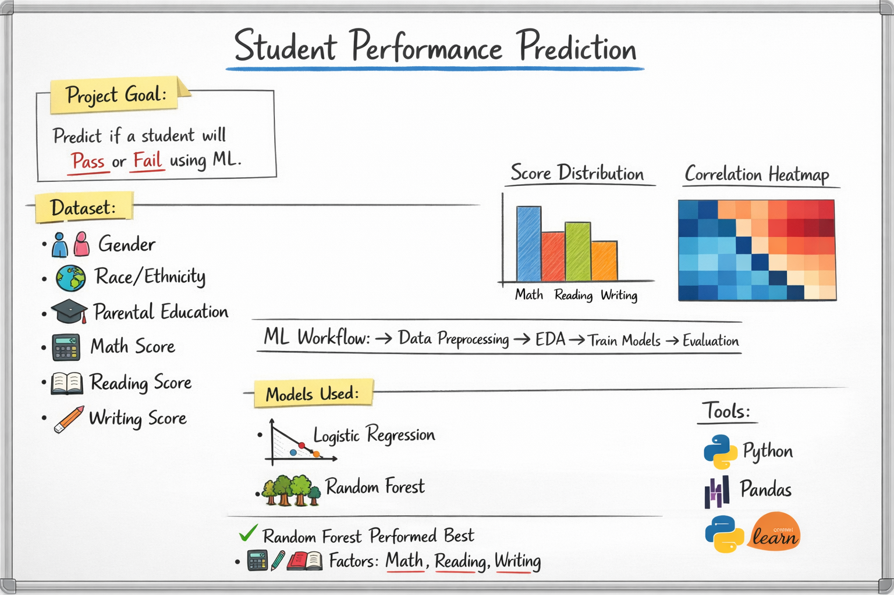

## Project Overview Diagram


# Student Performance Prediction

A Machine Learning project that predicts whether a student will pass or fail based on academic performance and demographic features.

---

## Project Overview

The goal of this project is to analyze student performance data and build machine learning models that can predict student outcomes.

By using classification algorithms, we can identify patterns in academic performance and understand factors that influence student success.

---

## Dataset

Dataset used: **Student Performance Dataset**

Features included:

* Gender
* Race/Ethnicity
* Parental Level of Education
* Lunch Type
* Test Preparation Course
* Math Score
* Reading Score
* Writing Score

---

## Machine Learning Workflow

The project follows a standard machine learning pipeline:

1. Import Libraries
2. Load Dataset
3. Dataset Exploration
4. Feature Engineering
5. Label Encoding
6. Exploratory Data Analysis
7. Train-Test Split
8. Logistic Regression Model
9. Random Forest Model
10. Model Evaluation

---

## Exploratory Data Analysis

### Distribution of Average Scores


### Feature Correlation Heatmap


---

## Model Training

Two machine learning models were trained.

### Logistic Regression

Used as a baseline classification model.

### Random Forest Classifier

An ensemble learning method that generally performs better for classification problems.

---

## Model Evaluation

### Confusion Matrix


Evaluation metrics used:

* Accuracy Score
* Confusion Matrix

---

## Results

Random Forest performed better than Logistic Regression for predicting student performance.

Important features affecting results:

* Math Score
* Reading Score
* Writing Score

---

## Technologies Used

* Python
* Pandas
* NumPy
* Scikit-Learn
* Matplotlib
* Seaborn
* Jupyter Notebook

---

## Project Structure

```
Student-Performance-Prediction
│
├── data
│   └── StudentsPerformance.csv
│
├── notebook
│   └── student_performance.ipynb
│
├── images
│   ├── confusion_matrix.png
│   ├── correlation_heatmap.png
│   └── score_distribution.png
│
└── README.md
```

---

## How to Run the Project

Clone the repository

```
git clone https://github.com/TheAkshatGupta/Student-Performance-Prediction.git
```

Install required libraries

```
pip install pandas numpy matplotlib seaborn scikit-learn
```

Open the notebook

```
jupyter notebook notebook/student_performance.ipynb
```

---

## Author

**Akshat Gupta**

Data Science / Machine Learning Enthusiast
