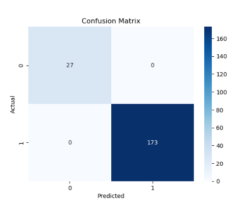
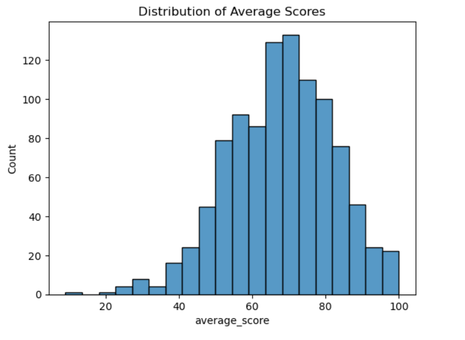
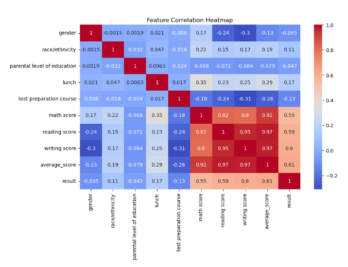

# Student Performance Prediction

## Project Overview
This project predicts whether a student will pass or fail based on academic performance and demographic features using Machine Learning models.

## Dataset
Dataset used: Student Performance Dataset

Features included:
- Gender
- Parental level of education
- Lunch type
- Test preparation course
- Math score
- Reading score
- Writing score

## Project Workflow

1. Import Libraries
2. Load Dataset
3. Data Exploration
4. Feature Engineering
5. Label Encoding
6. Exploratory Data Analysis
7. Train-Test Split
8. Logistic Regression Model
9. Random Forest Model
10. Model Evaluation

## Models Used

- Logistic Regression
- Random Forest Classifier

## Evaluation Metrics

- Accuracy Score
- Confusion Matrix

## Results

Random Forest performed better than Logistic Regression for predicting student performance.

## Technologies Used

- Python
- Pandas
- NumPy
- Scikit-Learn
- Matplotlib
- Seaborn
- Jupyter Notebook

## Model Evaluation

### Confusion Matrix

### Score Distribution

### Feature Correlation Heatmap
